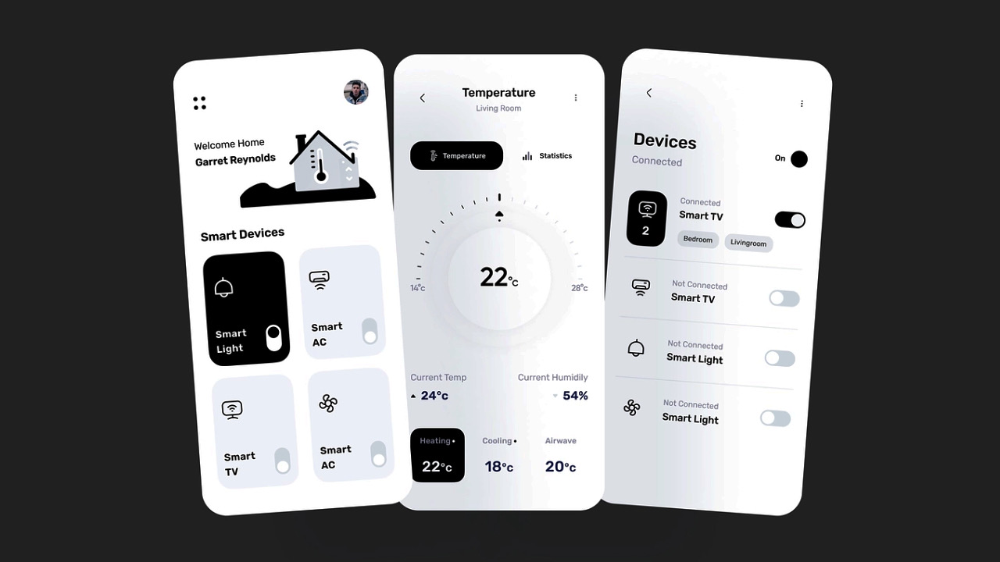

<<<<<<< HEAD
# Modern Smart Home UI

Modern Smart Home UI is a sleek and intuitive Flutter application designed to control and monitor smart home devices effortlessly. The app features a clean, responsive design with smooth animations and easy navigation, providing users with a seamless experience to manage lights, temperature, security systems, and more — all from their mobile device.

## Features

- **User-friendly interface:** Simple and modern design with clear icons and controls  
- **Device management:** Turn on/off lights, adjust thermostat settings, and control smart plugs  
- **Real-time updates:** Instant feedback from connected devices  
- **Customizable themes:** Light and dark mode support for comfortable use anytime  
- **Secure access:** User authentication and encrypted communication with devices

## Screenshot

>>>>>>> 3abbce96ab7474b3e936085d421564691cc517ed